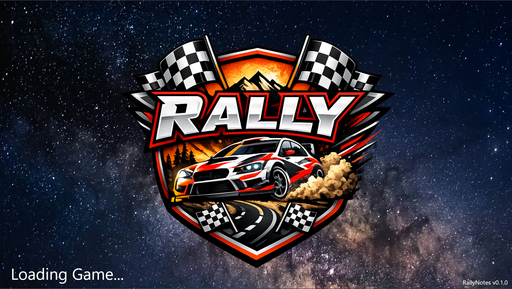
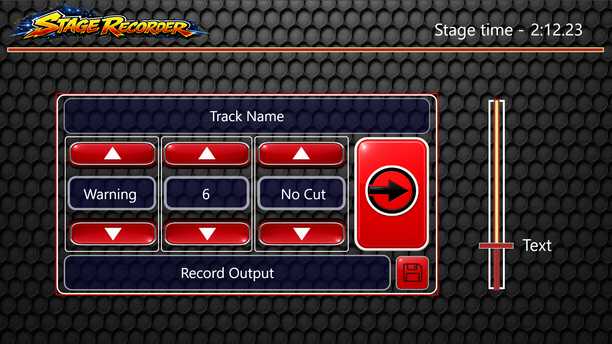
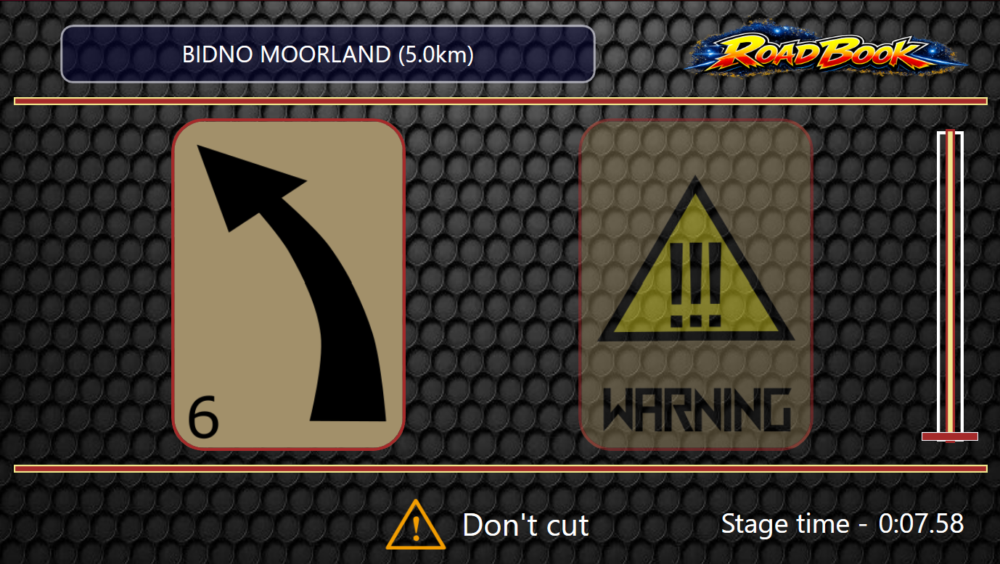

# 📖 User Guide: How to use RallyRoadbook

Welcome to the official user guide. This document explains the workflow for recording your own pacenotes and how to interpret the visual feedback from the dashboard.

---

## 🏁 1. Welcome & Standby Screen
When you launch the dashboard, you will be greeted by the **Welcome Screen**.

### Why is it stuck on "Waiting for Game..."?
The dashboard is designed to wait for a **live telemetry signal**. It will automatically transition to the Recording/Playback interface once:
1. A supported game is running (currently **Dirt Rally 1.0**).
2. You are physically on the track (SimHub is receiving "Live" status).
3. The plugin has successfully performed a handshake with the game's telemetry stream.

---

## 📝 2. Stage Recorder: Real-Time Note Recording
Once the plugin detects you are on track, the dashboard will activate the **Stage Recorder** interface. This screen allows you to perform a reconnaissance lap and create your own roadmap.

### ⚙️ Panel Functionality:
*   **Triple Selector (Rotary):** Allows you to configure the note before saving it:
    *   **Note type:** Select either “Righ-Left” or “Warning.”
    *   **Intensity:** Defines the corner tightness (from 1 to 6).
    *   **Modifier:** Adds extra info like "Don't Cut".
*   **Action Button (Large Icon):** When pressed, the plugin captures the vehicle's **exact position** on the stage and links the data selected on the rotary to that kilometer point.
*   **Save Button (Disk Icon):** Ends the recording session, automatically inserts the **"End of Stage"** icon, and generates the physical file.

### 💾 Data Storage
Files are automatically generated in `.json` format to keep them lightweight and easy to edit. The default path is:
`SimHub\DashTemplates\RallyRoadbook\StageRecords`

---

## 🏁 3. RoadBook Mode: Note Playback
When the plugin detects that a `.json` file already exists for the current track, the dashboard activates the **RoadBook** mode. This interface is optimized to let the digital co-driver anticipate hazards at top speed.

### 🧩 Interface Elements:
*   **Current Note (Left):** Shows the main icon of the note you are about to face immediately. Includes direction and intensity (e.g., Left 6).
*   **Next Note (Right - Faded):** A semi-transparent icon shows the upcoming note in the roadmap. This allows the driver to anticipate the line before reaching the execution point.
*   **Modifiers (Bottom):** Critical warnings like "Don't cut" appear highlighted at the bottom to prevent accidents.
*   **Stage Progress:**
    *   **Vertical Bar:** Visually indicates how much of the stage you have covered.
    *   **Stage Time:** Real-time stopwatch to monitor your pace.

### 🔄 Transition Dynamics
Notes move from **right to left**. As you pass a recorded kilometer point, the faded note moves to the foreground, and the system automatically loads the next one from the `.json` file. The cycle ends when reaching the **End of Stage** icon.

---

> [!TIP]
> File names are generated by track names (e.g., `Bidno_Moorland.json`) so you don't have to rename anything manually.
